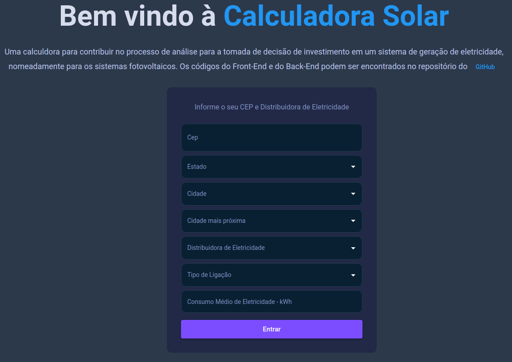
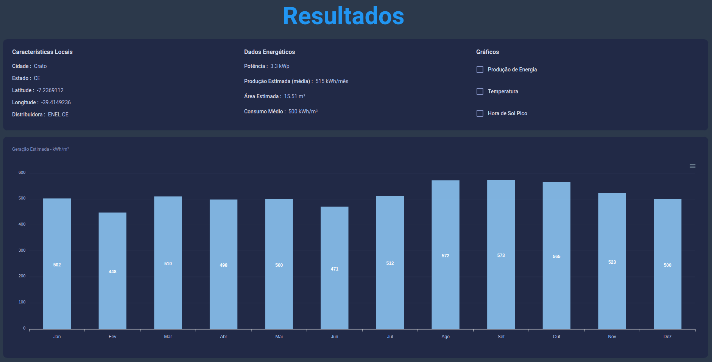

# Solar Calculator

## Table of Contents

1. [Overview](#overview)
2. [Technologies](#technologies)
    - 2.1 [Front-End](#front-end)
    - 2.2 [Back-End](#back-end)
3. [Quick Start](#quick-start)


### Overview

<p style="text-align: justify;">
The solar energy is one of the most important resources of electricity nowadays. In the last few years the solar photovoltaic had growth sustainable, because some countries, like Brazil, made laws allowing the famylies and the companies install solar system in yours own roof.
</p>

<p style="text-align: justify;">
That said, this project allows everyone to simulate a solar system to address their energy needs.
</p>

### Technologies

#### - Front-End

<p style="text-align: justify;">
To develop the front-end is used 
As back-end (REST API), the adopted technology is Node.js <a href="https://reactjs.org/" target="_blank">ReactJS</a>. Only two pages, a home page, where the user enters some data (zip code, state, city, energy distributor and its electricity demand). With the input data it is possible to locate the latitude and longitude.
</p>

<div align="center">
    <kbd>
        
    </kbd>
</div>

<p style="text-align: justify;">
The second page shows the sizing results, with the size of the solar system for users to meet their energy needs. 
</p>

<div align="center">
    <kbd>
        
    </kbd>
</div>

#### - Back-End

<p style="text-align: justify;">
As back-end (REST API), the adopted technology is Node <a href="https://expressjs.com/" target="_blank">express</a>. The front-end send the location data and the back-end locate the climatic of the location and make somes calculation and send back the results.

</p>

<p style="text-align: justify;">
For the database is used <a href="https://www.sqlite.org/index.html" target="_blank">SQLite</a>, an opebn source cross-platform. The database.db file is in ./back-end/prism/database.db. To manipulate the database <a href="https://www.prisma.io/docs/getting-started/quickstart" target="_blank">Prisma</a> is used, an open source database toolkit for PostgreSQL, MySQL, SQL Server and SQLite.
</p>

### Quick Start

<p style="text-align: justify;">
To run this project, clone the project on your machine:

#### Create the app:


```
$ cd front-end

$ npm install or yarn

$ npm or yarn start

```
#### Start the server

```
$ cd back-end

$ npm install or yarn

$ npm or yarn dev

```
</p>

<p style="text-align: justify;">
To any questions feel free to contact me.
</p>

### References

<p style="text-align: justify;">
Atlas Brasileiro de Energia Solar, INPE (Instituto Nacional de Pesquisas Espaciais), 2017. Disponível em: <a href="http://labren.ccst.inpe.br/" target="_blank">Atlas Brasileiro de Energia Solar</a>
</p>